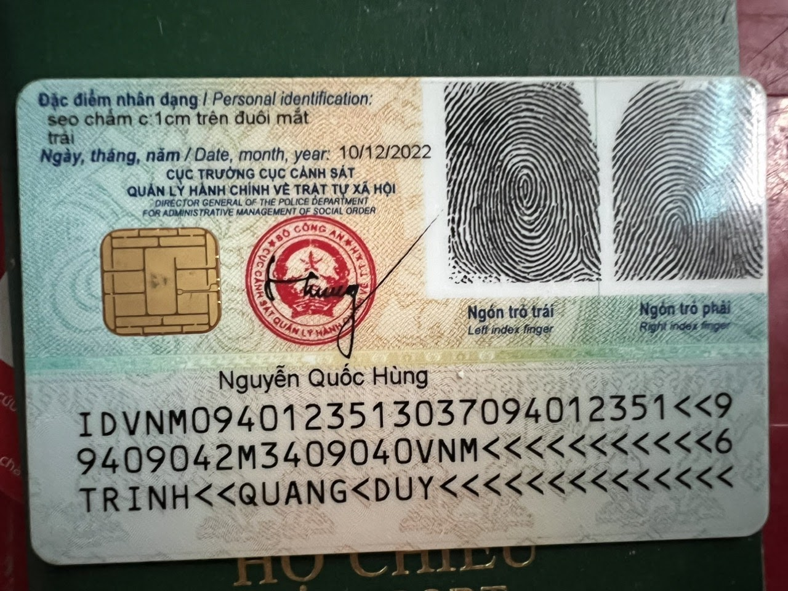
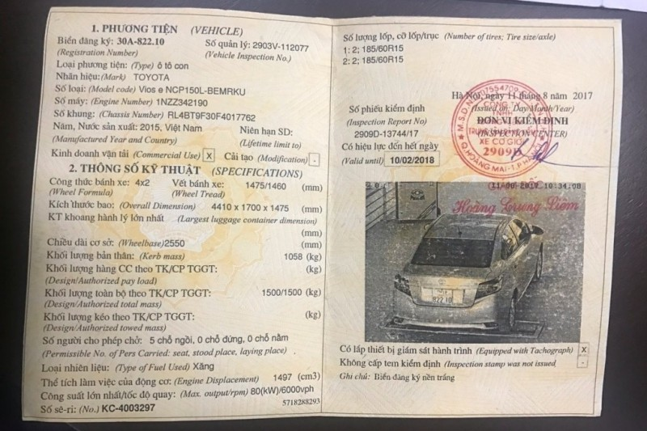
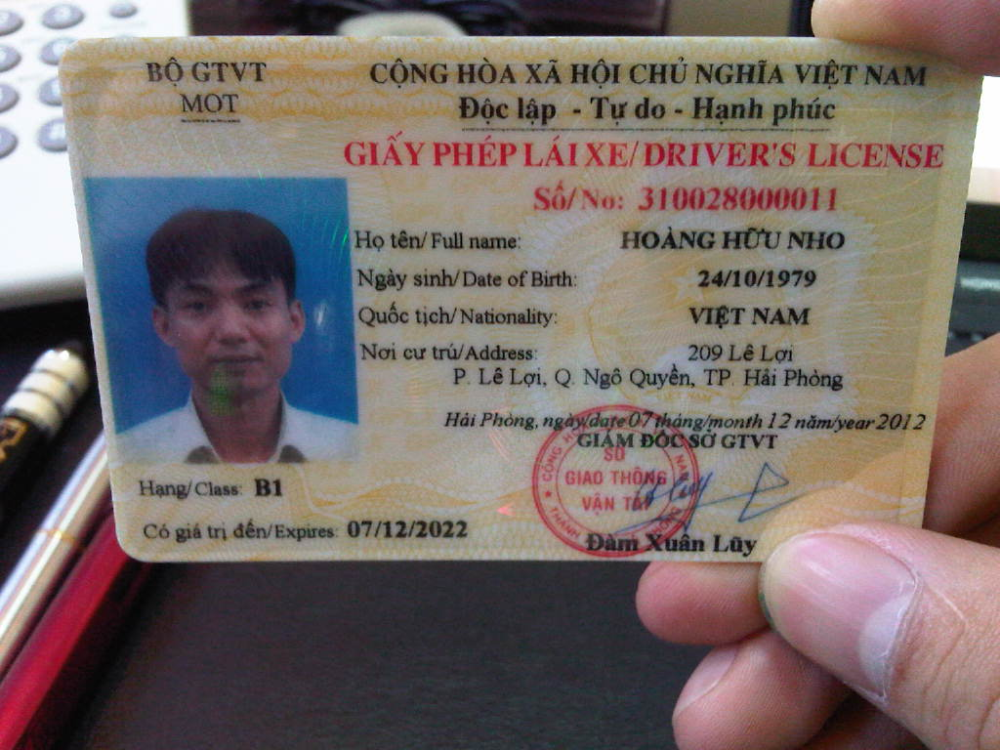
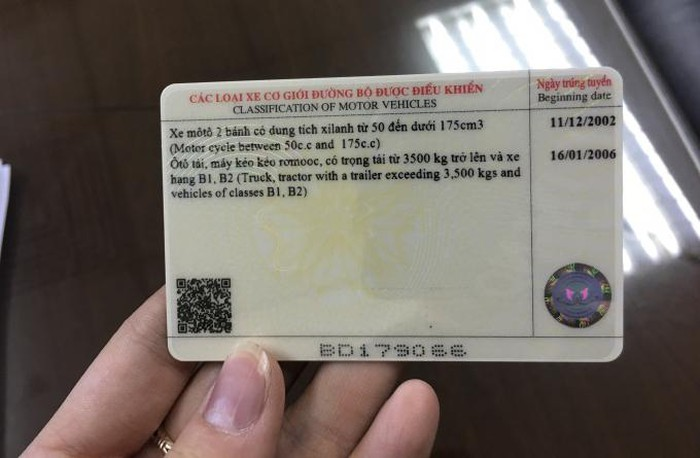
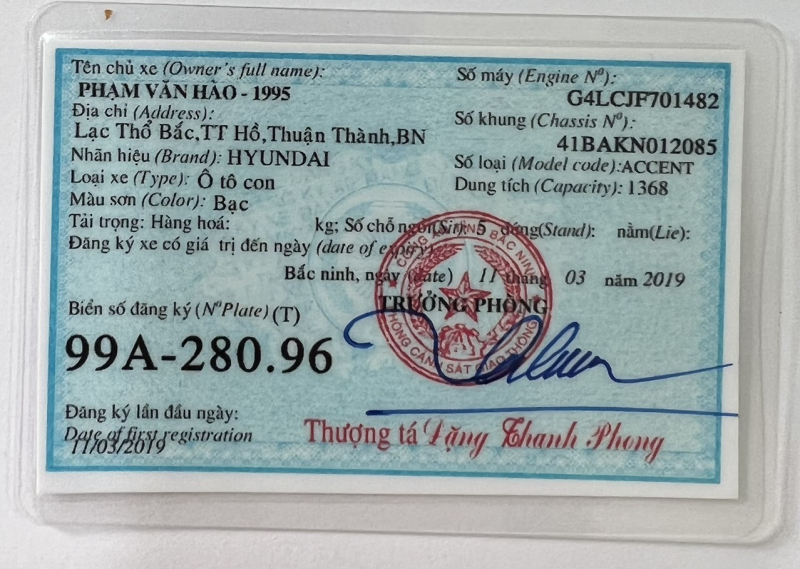

# Fine-tuned Qwen2-VL 2B  
 
## Introduction
This repository showcases the results of a fine-tuned version of  **Qwen2-VL 2B** model on a well-curated and labeled across wide a range of Vietnamese documents, including Citizen Identity Cards, Vehicle Inspection Reports, Vehicle Registrations, Driver's Licenses, Receipts.

This fine-tuned model aims to improve text extraction and structured data processing for Vietnamese documents, making it a potentially useful tool for automation and digital transformation.

## Examples

### Citizen Identity Card

<table>
  <tr>
    <td align="center">
      <br>
      <b>Back Side</b>
    </td>
    <td align="center">
      <br>
      <b>Front Side</b>
    </td>
  </tr>
</table>

<p align="center" style="font-size: 12px; color: gray; margin-top: 10px;">
  <a href="https://support.google.com/google-ads/thread/270967947/t%C3%B4i-%C4%91%C3%A3-g%E1%BB%ADi-h%C3%ACnh-%E1%BA%A3nh-c%C4%83n-c%C6%B0%E1%BB%9Bc-c%C3%B4ng-d%C3%A2n-c%E1%BB%A7a-ch%C3%ADnh-t%C3%B4i-%C4%91%E1%BB%83-x%C3%A1c-minh-danh-t%C3%ADnh?hl=vi" target="_blank">Source</a>
</p>

```
{
    "Loại giấy tờ": "CCCD_CHIP",
    "Số": "037094012351",
    "Họ và tên": "TRỊNH QUANG DUY",
    "Ngày sinh": "04/09/1994",
    "Giới tính": "Nam",
    "Quốc tịch": "Việt Nam",
    "Quê quán": "Tân Thành, Kim Sơn, Ninh Bình",
    "Nơi thường trú": "Xóm 6, Tân Thành, Kim Sơn, Ninh Bình",
    "Có giá trị đến": "04/09/2034",
    "Đặc điểm nhân dạng": "sẹo chấm c: 1cm trên đuôi mắt trái",
    "Ngày cấp": "10/12/2022",
    "Nơi cấp": "CỤC TRƯỞNG CỤC CẢNH SÁT QUẢN LÝ HÀNH CHÍNH VỀ TRẬT TỰ XÃ HỘI",
    "Người ký": "Nguyễn Quốc Hùng",
    "MRZ": {
        "MRZ_1": "IDVNM0940123513037094012351<<9",
        "MRZ_2": "9409042M3409040VNM<<<<<<<<<<<6",
        "MRZ_3": "TRINH<<QUANG<DUY<<<<<<<<<<<<<<"
    }
}
```
      
### Vehicle Inspection Report
<table>
  <tr>
    <td align="center" >
      <br>
      <b>Inspection Certificate</b>
    </td>
  </tr>
</table>

<p align="center" style="font-size: 12px; color: gray; margin-top: 10px;">
<a href="https://xegaznga.com/giay-chung-nhan-kiem-dinh-xe-o-to/" target="_blank">Source</a>
</p>

```
{
    "PHƯƠNG TIỆN (VEHICLE)": {
        "Biển đăng kí (Registration Number)": "30A-822.10",
        "Số quản lý (Vehicle Inspection No.)": "2903V-112077",
        "Loại phương tiện (Type)": "ô tô con",
        "Nhãn hiệu (Mark)": "TOYOTA",
        "Số loại (Model code)": "Vios e NCP150L-BEMRKU",
        "Số máy (Engine Number)": "1NZZ342190",
        "Số khung (Chasis Number)": "RL4BT9F30F4017762",
        "Năm, Nước sản xuất (Manufactured Year and Country)": "2015, Việt Nam",
        "Niên hạn SD (Lifetime limit to)": "",
        "Kinh doanh vận tải (Commercial Use)": "Có",
        "Cải tạo (Modification)": "Không"
    },
    "THÔNG SỐ KỸ THUẬT (SPECIFICATIONS)": {
        "Công thức bánh xe (Wheel Formula)": "4x2",
        "Vết bánh xe (Wheel Tread)": "1475/1460 (mm)",
        "Kích thước bao (Overall Dimension)": "4410 x 1700 x 1475 (mm)",
        "KT khoang hành lý lớn nhất (Largest luggage container dimension)": "",
        "Chiều dài cơ sở (Wheelbase)": "2550 (mm)",
        "Khối lượng bản thân (Kerb mass)": "1058 (kg)",
        "Khối lượng hàng CC theo TK/CP TGGT (Design/Authorized payload)": "",
        "Khối lượng toàn bộ theo TK/CP TGGT (Design/Authorized total mass)": "1500/1500 (kg)",
        "Khối lượng kéo theo TK/CP TGGT (Design/Authorized towed mass)": "",
        "Số người cho phép chở (Permissible No. of Pers Carried: seat, stood place, laying place)": "5 chỗ ngồi, 0 chỗ đứng, 0 chỗ nằm",
        "Loại nhiên liệu (Type of Fuel Used)": "Xăng",
        "Thể tích làm việc của động cơ (Engine Displacement)": "1497 (cm3)",
        "Công suất lớn nhất/tốc độ quay (Max. output/rpm)": "80(kW)/6000vph",
        "Số sê-ri (No.)": "KC-4003297",
        "Số lượng lốp, cỡ lốp/trục (Number of tires; tire size/axle)": "1: 2; 185/60R15\n2: 1; 185/60R15",
        "Có lắp thiết bị giám sát hành trình (Equipped with Tachograph)": "Có",
        "Không cấp tem kiểm định (Inspection stamp was not issued)": "Không",
        "Ghi chú": "Biển đăng ký nền trắng"
    },
    "THÔNG TIN KHÁC": {
        "Số phiếu kiểm định (Inspection Report No)": "2909D-13744/17",
        "Có hiệu lực đến hết ngày (Valid until)": "10/02/2018",
        "Issued on Day/Month/Year": "Hà Nội, ngày 11 tháng 8 năm 2017"
    }
}
```

### Driver's license

<table>
  <tr>
    <td align="center">
      <br>
      <b>Back Side</b>
    </td>
    <td align="center">
      <br>
      <b>Front Side</b>
    </td>
  </tr>
</table>

<p align="center" style="font-size: 12px; color: gray; margin-top: 10px;">
<a href="https://hoclaixeotocaptoc.com/giay-phep-lai-xe-tu-dong-la-gi/https://vovgiaothong.vn/gplx-in-ma-qr-co-tac-dung-gi-d18519.html" target="_blank">Source</a>
</p>

```
{
    "Số": "310028000011",
    "Họ tên": "HOÀNG HỮU NHO",
    "Ngày sinh": "24/10/1979",
    "Quốc tịch": "VIỆT NAM",
    "Nơi cư trú": "209 Lê Lợi, P. Lê Lợi, Q. Ngò Quyền, TP. Hải Phòng",
    "Hạng": "B1",
    "Có giá trị đến": "07/12/2022",
    "Nơi cấp, ngày cấp": "Hải Phòng, ngày 07 tháng 12 năm 2012",
    "Người ký": "Đàm Xuân Luyện",
    "CÁC LOẠI XE CƠ GIỚI ĐƯỢC ĐIỀU KHIỂN": [
        "Xe mô tô 2 bánh có dung tích xilanh từ 50 đến dưới 175cm3 (Motor cycle between 50c.c dưới 175c.c)",
        "Ôtô tải, máy kéo kéo rơmooc, có trọng tải từ 3500 kg trở lên và xe hạng B1, B2 (Truck, tractor with a trailer exceeding 3,500 kgs and vehicles of classes B1, B2)"
    ],
    "Ngày trúng tuyển": [
        "11/12/2002",
        "16/01/2006"
    ]
}
```

### Vehicle Registration

<table>
  <tr>
    <td align="center">
      <br>
      <b>Inspection Certificate</b>
    </td>
  </tr>
</table>

<p align="center" style="font-size: 12px; color: gray; margin-top: 10px;">
  <a href="https://cand.com.vn/Ban-tin-113/dung-dang-ky-xe-gia-den-nop-phat-i639373/" target="_blank">Source</a>
</p>

```
{
    "Tên chủ xe": "PHẠM VĂN HÀO - 1995",
    "Địa chỉ": "Lạc Thổ Bắc, TT Hồ, Thuận Thành, BN",
    "Nhãn hiệu": "HYUNDAI",
    "Số máy": "G4LCJF701482",
    "Số khung": "41BAKN012085",
    "Số loại": "ACCENT",
    "Loại xe": "Ô tô con",
    "Dung tích": "1368",
    "Màu sơn": "Bạc",
    "Tải trọng": {
        "Hàng hoá": "",
        "Số chỗ ngồi": "5",
        "Đứng": "",
        "Nằm": ""
    },
    "Giá trị đến ngày": "",
    "Hoạt động trong phạm vi": "",
    "Biển số đăng kí": "99A-280.96",
    "Đăng kí lần đầu ngày": "11/03/2019",
    "Nơi đăng kí, ngày đăng kí": "Bắc Ninh, ngày 11 tháng 03 năm 2019"
}
```
## Acknowledgments
- [Qwen2 VL](https://huggingface.co/Qwen/Qwen2-VL-2B-Instruct)

